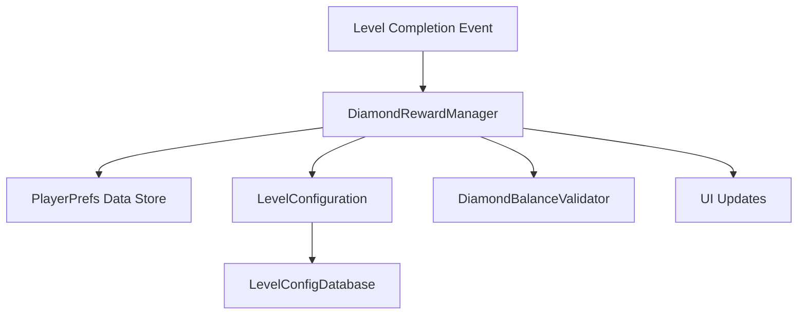
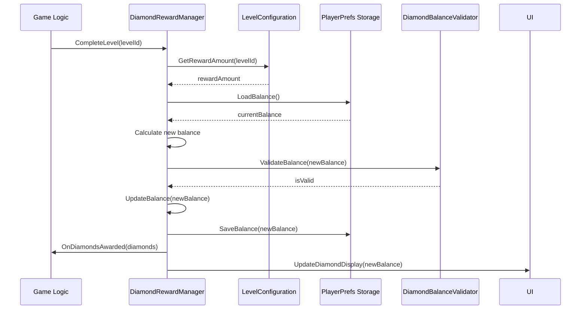

# Design Document: Diamond Rewards System

## Overview

The Diamond Rewards System is a Unity-based game feature that manages in-game diamond currency acquisition through level completion. Players earn configurable diamond rewards when they complete levels, and their balance persists across game sessions using PlayerPrefs. The system provides a clean API for awarding diamonds, querying balances, and ensuring data integrity through validation mechanisms.

## Architecture





## Components and Interfaces

### Component 1: IDiamondRewardService

**Purpose**: Core service interface for diamond reward operations

**Interface**:
```csharp
public interface IDiamondRewardService
{
    int GetCurrentBalance();
    int AwardDiamonds(string levelId);
    bool TryAwardDiamonds(string levelId, out int awardedAmount);
    void InitializePlayerData();
}
```

**Responsibilities**:
- Provide public API for diamond operations
- Coordinate between configuration, storage, and validation
- Handle level completion events
- Manage data initialization for new players

### Component 2: LevelConfiguration

**Purpose**: Manages diamond reward amounts per level

**Interface**:
```csharp
public class LevelConfiguration
{
    public int GetRewardAmount(string levelId);
    public void SetRewardAmount(string levelId, int amount);
    public bool HasRewardConfig(string levelId);
    public IDictionary<string, int> GetAllRewards();
}
```

**Responsibilities**:
- Store and retrieve diamond reward amounts
- Validate reward amounts are non-negative
- Support dynamic configuration changes

### Component 3: DiamondBalanceStorage

**Purpose**: Handles PlayerPrefs persistence operations

**Interface**:
```csharp
public class DiamondBalanceStorage
{
    public int LoadBalance();
    public void SaveBalance(int amount);
    public bool Exists();
    public void Delete();
}
```

**Responsibilities**:
- Read diamond balance from PlayerPrefs
- Write updated balance to PlayerPrefs
- Handle missing or corrupted data
- Provide existence checks

### Component 4: DiamondBalanceValidator

**Purpose**: Ensures data integrity for diamond balances

**Interface**:
```csharp
public class DiamondBalanceValidator
{
    public bool IsValidBalance(int balance);
    public bool IsValidRewardAmount(int amount);
    public int ClampToValidRange(int balance);
}
```

**Responsibilities**:
- Validate balance values are non-negative integers
- Validate reward amounts are within acceptable ranges
- Provide safe clamping for invalid values

### Component 5: DiamondRewardManager

**Purpose**: Main implementation combining all components

**Interface**:
```csharp
public class DiamondRewardManager : IDiamondRewardService
{
    public event Action<int> OnDiamondsChanged;
    public event Action<string, int> OnDiamondsAwarded;
    
    public int GetCurrentBalance();
    public int AwardDiamonds(string levelId);
    public bool TryAwardDiamonds(string levelId, out int awardedAmount);
    public void InitializePlayerData();
}
```

**Responsibilities**:
- Coordinate all diamond reward operations
- Publish events for UI and game logic
- Handle initialization and state management
- Provide error handling and recovery

## Data Models

### Model 1: DiamondBalance

```csharp
public struct DiamondBalance
{
    public int Amount { get; }
    
    public DiamondBalance(int amount)
    {
        Amount = amount;
    }
    
    public static DiamondBalance Zero => new DiamondBalance(0);
    
    public bool IsValid => Amount >= 0;
    
    public static DiamondBalance operator +(DiamondBalance left, DiamondBalance right)
    {
        return new DiamondBalance(left.Amount + right.Amount);
    }
}
```

**Validation Rules**:
- Amount must be a non-negative integer
- Default value is zero for new players
- Cannot be negative or null

### Model 2: LevelRewardConfig

```csharp
public class LevelRewardConfig
{
    public string LevelId { get; set; }
    public int RewardAmount { get; set; }
    
    public bool IsValid()
    {
        return !string.IsNullOrEmpty(LevelId) && RewardAmount >= 0;
    }
}
```

**Validation Rules**:
- LevelId must be a non-empty string
- RewardAmount must be a non-negative integer
- Config is only valid when both conditions are met

### Model 3: AwardResult

```csharp
public class AwardResult
{
    public bool Success { get; set; }
    public int AwardedAmount { get; set; }
    public int NewBalance { get; set; }
    public string ErrorMessage { get; set; }
}
```

**Validation Rules**:
- Success indicates if award operation succeeded
- AwardedAmount reflects the diamonds earned
- NewBalance shows the updated total
- ErrorMessage contains details for failures

## Algorithmic Pseudocode

### Main Diamond Award Algorithm

```pascal
ALGORITHM AwardDiamondsForLevel
INPUT: levelId (String)
OUTPUT: AwardResult

BEGIN
  // Step 1: Load current balance from storage
  currentBalance ← LoadDiamondBalance()
  
  // Step 2: Get reward amount for level
  rewardAmount ← GetLevelRewardAmount(levelId)
  
  // Step 3: Calculate new balance
  newBalance ← currentBalance + rewardAmount
  
  // Step 4: Validate the new balance
  IF NOT ValidateBalance(newBalance) THEN
    // Safety fallback: clamp to valid range
    newBalance ← ClampBalanceToValidRange(newBalance)
    log(WARNING, "Balance clamped to valid range")
  END IF
  
  // Step 5: Save updated balance
  SaveDiamondBalance(newBalance)
  
  // Step 6: Publish event for UI updates
  PublishDiamondsChanged(newBalance)
  
  // Step 7: Return result
  RETURN AwardResult(
    Success = true,
    AwardedAmount = rewardAmount,
    NewBalance = newBalance
  )
END
```

**Preconditions:**
- `levelId` is a valid, non-empty string identifier
- Level configuration exists or has a default reward
- PlayerPrefs storage is accessible

**Postconditions:**
- Diamond balance is updated and persisted
- `OnDiamondsChanged` event is fired
- Result object contains award details

**Loop Invariants:**
- Balance remains a non-negative integer throughout
- Persisted data matches in-memory state

### Level Reward Configuration Lookup

```pascal
ALGORITHM GetLevelRewardAmount
INPUT: levelId (String)
OUTPUT: rewardAmount (Integer)

BEGIN
  // Check if configuration exists for level
  IF LevelConfigDatabase.ContainsLevel(levelId) THEN
    rewardAmount ← LevelConfigDatabase.GetReward(levelId)
    
    // Validate retrieved amount
    IF NOT ValidateRewardAmount(rewardAmount) THEN
      log(WARNING, "Invalid reward amount, using default")
      rewardAmount ← DEFAULT_REWARD_AMOUNT
    END IF
  ELSE
    // Use default reward for unknown levels
    rewardAmount ← DEFAULT_REWARD_AMOUNT
    log(WARNING, "No config for level, using default: " + levelId)
  END IF
  
  RETURN rewardAmount
END
```

**Preconditions:**
- `levelId` is a valid string identifier
- `DEFAULT_REWARD_AMOUNT` constant is defined

**Postconditions:**
- Returns valid non-negative reward amount
- Logs warnings for invalid configurations

**Loop Invariants:**
- Reward amount is always clamped to valid range before return

### Diamond Balance Loading with Validation

```pascal
ALGORITHM LoadDiamondBalance
OUTPUT: balance (Integer)

BEGIN
  // Check if PlayerPrefs key exists
  IF PlayerPrefs.HasKey(DIAMOND_BALANCE_KEY) THEN
    storedValue ← PlayerPrefs.GetInt(DIAMOND_BALANCE_KEY)
    
    // Validate stored data
    IF ValidateInteger(storedValue) AND storedValue >= 0 THEN
      balance ← storedValue
    ELSE
      log(ERROR, "Corrupted PlayerPrefs data, resetting to zero")
      balance ← 0
      SaveDiamondBalance(balance)  // Reset storage
    END IF
  ELSE
    // New player - initialize to zero
    balance ← 0
    SaveDiamondBalance(balance)  // Create PlayerPrefs entry
  END IF
  
  RETURN balance
END
```

**Preconditions:**
- `DIAMOND_BALANCE_KEY` constant is defined
- `ValidateInteger` function exists

**Postconditions:**
- Returns valid non-negative balance
- PlayerPrefs entry is created if missing
- Corrupted data is reset to zero

**Loop Invariants:**
- Balance is always validated before return
- Storage is cleaned up if corrupted

## Key Functions with Formal Specifications

### GetCurrentBalance()

```csharp
public int GetCurrentBalance()
```

**Preconditions:**
- Player data has been initialized (via InitializePlayerData or first access)
- PlayerPrefs storage is accessible

**Postconditions:**
- Returns current diamond balance as non-negative integer
- If PlayerPrefs data is corrupted, returns 0
- If no existing data, initializes and returns 0

**Error Cases:**
- Returns 0 if PlayerPrefs is inaccessible or corrupted

### AwardDiamonds(levelId)

```csharp
public int AwardDiamonds(string levelId)
```

**Preconditions:**
- `levelId` is a non-null string identifier
- Level configuration system is operational

**Postconditions:**
- Returns the diamond amount awarded for this level
- Updates player's total diamond balance
- Persists updated balance to PlayerPrefs
- Fires OnDiamondsChanged event

**Error Cases:**
- If level configuration is missing, uses default reward
- If PlayerPrefs save fails, logs error but returns awarded amount

### InitializePlayerData()

```csharp
public void InitializePlayerData()
```

**Preconditions:**
- None (can be called at any time)

**Postconditions:**
- Creates PlayerPrefs entry for diamond balance if missing
- Sets balance to 0 for new players
- Does not overwrite existing valid data

**Error Cases:**
- Silently handles PlayerPrefs access failures

## Example Usage

### Awarding Diamonds on Level Completion

```csharp
// In level completion handler
public void OnLevelCompleted(string levelId)
{
    int awarded = diamondRewardService.AwardDiamonds(levelId);
    Debug.Log($"Awarded {awarded} diamonds for completing {levelId}");
    
    // Update UI
    diamondDisplay.UpdateBalance(diamondRewardService.GetCurrentBalance());
}
```

### Querying Diamond Balance

```csharp
// In UI component
public void UpdateDiamondDisplay()
{
    int balance = diamondRewardService.GetCurrentBalance();
    diamondText.text = $"Diamonds: {balance}";
}
```

### Initializing for New Player

```csharp
// In game startup
private void Start()
{
    diamondRewardService.InitializePlayerData();
    UpdateDiamondDisplay();
    
    // Subscribe to balance changes
    diamondRewardService.OnDiamondsChanged += UpdateDiamondDisplay;
}
```

## Correctness Properties

### Property 1: Balance Integrity

**Universal Quantification**: For all players, the diamond balance is always a non-negative integer.

```
∀ player ∈ Players: GetCurrentBalance(player) ≥ 0
```

**Verification**: The validator ensures all balance values are clamped to the range [0, Int32.MaxValue].

### Property 2: Persistence Consistency

**Universal Quantization**: After awarding diamonds, the persisted balance matches the returned new balance.

```
∀ levelId ∈ LevelIds:
  let result = AwardDiamonds(levelId)
  result.NewBalance == LoadPersistedBalance()
```

**Verification**: The save operation occurs before returning, and the new balance is stored atomically.

### Property 3: Idempotent Initialization

**Universal Quantification**: Initializing player data multiple times always results in a valid state.

```
∀ n ∈ ℕ: InitializePlayerData()ⁿ produces valid state
```

**Verification**: The initialization checks for existing valid data and only creates new entries if missing.

### Property 4: Accumulative Awards

**Universal Quantification**: Completing levels repeatedly accumulates diamonds correctly.

```
∀ levelIds: 
  let initial = GetCurrentBalance()
  let totalReward = Σ GetRewardAmount(l) for l in levelIds
  ForEach(levelIds, AwardDiamonds)
  GetCurrentBalance() == initial + totalReward
```

**Verification**: Each award adds to the current balance, and validation ensures no data corruption.

## Error Handling

### Error Scenario 1: Corrupted PlayerPrefs Data

**Condition**: PlayerPrefs contains invalid or corrupted diamond balance data

**Response**: 
- Log error message with details
- Reset balance to zero
- Save clean state to PlayerPrefs

**Recovery**: Player starts with zero diamonds; game continues normally

### Error Scenario 2: Missing Level Configuration

**Condition**: No reward configuration exists for a completed level

**Response**:
- Log warning message
- Use default reward amount
- Continue with award process

**Recovery**: Player receives default reward; game continues normally

### Error Scenario 3: PlayerPrefs Write Failure

**Condition**: Unable to save updated balance to PlayerPrefs

**Response**:
- Log error message with error details
- Return award result with success=false
- Update in-memory balance for UI consistency

**Recovery**: Balance may not persist across sessions; player should retry level

## Testing Strategy

### Unit Testing Approach

**Key Test Cases**:
1. Awarding diamonds increases balance correctly
2. Loading balance from PlayerPrefs returns stored value
3. New players start with zero diamonds
4. Corrupted PlayerPrefs data is reset to zero
5. Invalid reward amounts are handled gracefully

**Coverage Goals**:
- All public methods tested
- All error scenarios covered
- Edge cases (zero balance, max value) tested

### Property-Based Testing Approach

**Property Test Library**: fast-check (for JavaScript/TypeScript) or NUnit Property-based Testing (for C#)

**Properties to Test**:
1. **Balance Non-Negativity**: All balance values are ≥ 0
2. **Additive Awards**: Multiple awards sum to total balance
3. **Persistence Round-Trip**: Saved and loaded balance matches
4. **Idempotent Initialize**: Multiple initializations produce same result

### Integration Testing Approach

**Test Scenarios**:
1. Complete level → Check diamond display updates
2. Restart game → Check balance persists
3. Award multiple levels → Check accumulation
4. Clear PlayerPrefs → Check initialization to zero

## Performance Considerations

### Memory Usage
- Diamond balance: 4 bytes (int)
- PlayerPrefs storage: minimal overhead
- No caching needed; direct PlayerPrefs access

### Speed
- Balance load: O(1) - single PlayerPrefs read
- Balance save: O(1) - single PlayerPrefs write
- Reward lookup: O(1) - dictionary lookup or direct access

### Optimization Opportunities
- Consider caching balance in memory if accessed frequently
- Batch operations if awarding multiple levels simultaneously
- Debounce saves if awarded in rapid succession

## Security Considerations

### Threat Model
1. **Player Cheat**: Players may attempt to modify PlayerPrefs directly
2. **Data Corruption**: Storage device issues or game bugs

### Mitigation Strategies
1. **Data Validation**: All values validated before use
2. **Error Recovery**: Graceful handling of corrupted data
3. **Minimal Sensitive Data**: Diamonds are non-critical currency
4. **Platform Security**: Rely on Unity's PlayerPrefs obfuscation

## Dependencies

### Unity Dependencies
- Unity Engine (for PlayerPrefs API)
- No additional packages required

### Project Dependencies
- Level configuration system (external or internal)
- UI display components (optional, for visual feedback)

### External Services
- None - fully local storage
